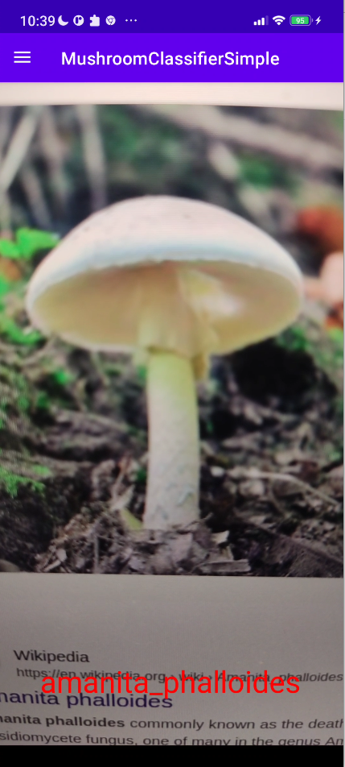

# Mushroom Classifier

**Authors**: <a href="https://github.com/viktorpovazhuk">Viktor Povazhuk</a>, <a href="https://github.com/bogdanmagometa">Bohdan Mahometa</a>.

This Android application is designed to classify images of mushrooms using the phone's camera. The app utilizes machine learning techniques to assign mushroom images to specific classes.

The deployed model is based on the MobileNetV2. The corresponding notebook with modeling is available <a href="https://www.kaggle.com/code/vikpov/mushrooms-classifier-2">here</a>. The accuracy of the model on test dataset is $69 \\%$.

Additionally, better results ($82 \\%$ accuracy) are achieved by applying the contrastive self-supervised learning algorithms described <a href="https://arxiv.org/abs/2002.05709">here</a>, but this model is not yet deployed. The corresponing notebook with modeling is available <a href="https://www.kaggle.com/code/vikpov/self-mushrooms-classifier-2">here</a>.

## Features

1. Available classes. The application allows users to capture an image and classify it into one of the following mushroom classes:
- Agaricus Xanthodermus
- Amanita Muscaria
- Amanita Phalloides
- Armillaria Mellea
- Boletus Edulis
- Cantharellus Cibarius
- Chalciporus Piperatus
- Hygrophoropsis Aurantiaca
- Hypholoma Fasciculare
- Inocybe Geophylla
- Rubroboletus Satanas
- Russula Emetica
- Russula Vesca
- Suillus Luteus

2. Real-time low-latency classification. Users can capture images in real-time using their device's camera and instantly receive the classification results.

3. Offline functionality. The app works offline, allowing users to classify images without an internet connection. (One-time internet connection is neccessary though for downloading the model to the phone).

4. Updating the model. The app allows for synchronization of the model with the most-recent one upon Internet connection is available.

## Installation

Two options are provided.

### Option 1: Use the provided APK

The APK file is attached to the release.

### Option 2: Build and deploy to connected device
Run the following in the project root directory:
```bash
$ ./gradlew installDebug
```


## Usage

- Launch the Mushroom Classifier app on your Android device.
- Grant necessary permissions for the app to access the camera.
- Capture a photo of a mushroom using the camera. The predictions are seen immediately.



